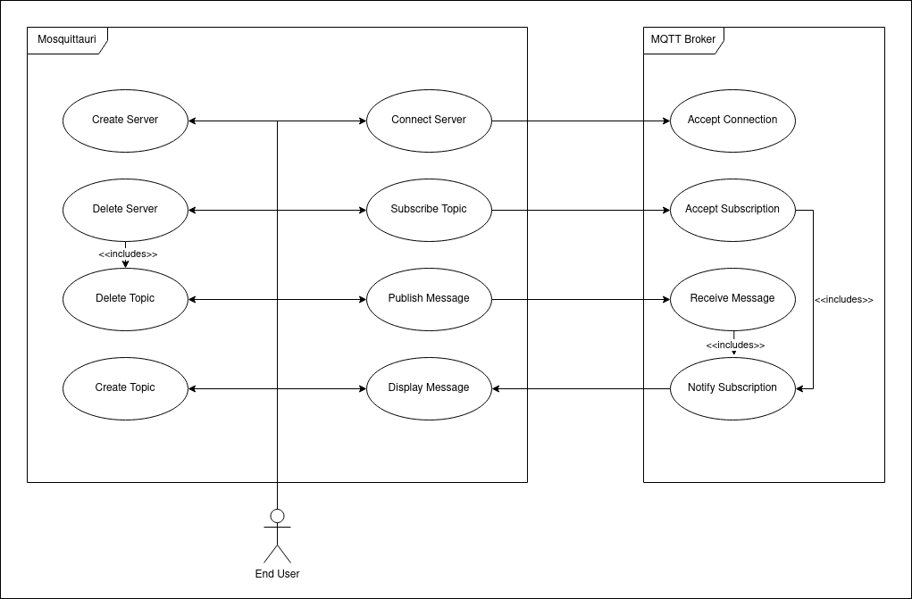

# Overview

## 1. Introduction and Goals

Mosquittauri is an Application designed to be a pretty Interface for MQTT Communication.

## 1.1 Quality Goals

- The Application should start quickly.
- Settings should be persisted between executions.
- The Software should be pleasing to look at.
- Publishing and Sending should be done independantly.
- Multiple Topics can be subscribed at once.

## 2. Constraints

- The Application should run under Windows.
- The Application should contain all necessary dependencies to run.
- The Application should be written in an object-oriented language.

## 3. Context and Scope

### 3.1 Business Context

#### Use Case Diagram

The Diagram below illustrates what the Use Case (or Relationship) between Mosquittauri, it's User, and the MQTT Broker are, including the relationship between Components in MSQT.

## 4. Solution Strategy

### 4.1 React Frontend

The React frontend provides a dynamic, component-based user interface for the application. React allows for efficient rendering and state management, making it ideal for building modern, interactive user interfaces. In this project, the React frontend interacts with the Rust backend through Tauri commands, enabling native functionality.

For more information about React, visit the [official React website](https://reactjs.org/).

### 4.2 Tauri/Rust Backend

The **Rust** backend, which **Tauri** provides, powers the native functionality of the application, allowing seamless communication with the operating system and efficient performance. In this project, Tauri enables the React frontend to interact with Rust through commands, allowing the backend to handle system-level tasks, such as file or registry access, and return results asynchronously.

For more information about Tauri and Rust, visit the [official Tauri website](https://tauri.app/) and the [official Rust website](https://www.rust-lang.org/).

### 4.3 Bundling with Tauri

Tauri is used to bundle the application into a lightweight, cross-platform desktop app. It packages the **React frontend** and **Rust backend** into a single executable with a minimal footprint. Tauri’s bundling process ensures secure, fast, and efficient deployment while keeping system resources usage low.

### 4.4 JSON Storage

Originally developed as a temporary solution until the SQL Integration exists, the JSON Storage provides a simple way to store Settings for the Application. It utilizes multiple JSON Files, that will be generated in the Folder where the MSQT is executed.

### 4.5 SQLite Database

#### TODO: SQL DOKUMENTIEREN

### 5, Building Block View

The following Diagram illustrates the classes and methods of the MQTT Part of the Backend

### 6. Runtime View

#### 6.1 MQTT Communication

The following Diagram shows the Process of how MSQT communicates with the MQTT Broker.

#### TODO: SEQUENCE DIAGRAM

## 7. Deployment View

We use a Github Actions Pipeline to automatically build the Application for multiple Platforms, including Windows, Linux and MacOS. This ensures consistent and reproducible builds, as well as giving us multiple "snapshots" of how the Program behaved throughout versions.

## 8. Architectural Decisions

- We use Node.js Version 22.x since it's the currently active LTS Node.js Version ([more info](https://nodejs.org/en/about/previous-releases))
- Since Next.js Server Components are only ran at compile time, we have to use the Rust Backend provided by Tauri to do backend work on the machine. This includes how we do MQTT, SQL and other functions to manipulate the file system or interact with other systems.
- Because this would require some very in-depth mocking of the Tauri Event system, or a very complicated Pipeline Setup, we decided later on **not** to do End-To-End Testing using Cypress. This results in the Frontend not being automatically tested.

## 9. Risks and Technical Debts

### 9.1 Risks

| Title                       | Description                                                                                                                                                                                                                                                                                                                                                      |
| --------------------------- | ---------------------------------------------------------------------------------------------------------------------------------------------------------------------------------------------------------------------------------------------------------------------------------------------------------------------------------------------------------------- |
| No Developers using Windows | None of the Developers working on Mosquittauri are using Windows, neither for Development, nor much for Private Use. As thus, the Application was not thoroughly tested on Windows until the end. This Risk is mitigated by the fact that the Github Actions Pipeline always builds and tests on Windows as well, but some behavior might be slightly different. |
| No CSP                      | We have set our Content Security Policy to None because we had issues in the final build. Normally, this is highly discouraged, but we ran out of time and could not fix this properly.                                                                                                                                                                          |

### 9.2 Technical Debts

| Title                    | Description                                                                                                                                                                                                                                                                             |
| ------------------------ | --------------------------------------------------------------------------------------------------------------------------------------------------------------------------------------------------------------------------------------------------------------------------------------- |
| No User-Defined ClientID | In Development, we forgot to add a way for the User to set the Client ID that is going to be sent to the Broker (Kind of like a username). We wanted to add this later on, but ran out of time.                                                                                         |
| Ignored Warnings         | During Development and Deployment, we have sometimes opted to ignore Warnings. These warnings do not have an impact on the final Application, however they can have an impact on Code Quality. Due to Time Constraints, we have opted not to address these properly for the time being. |

## 10. Glossary

| Abbreviation | Description                                |
| ------------ | ------------------------------------------ |
| MSQT         | The Name of the Application - Mosquittauri |
| MQTT         | Message Queuing Telemetry Transport        |
